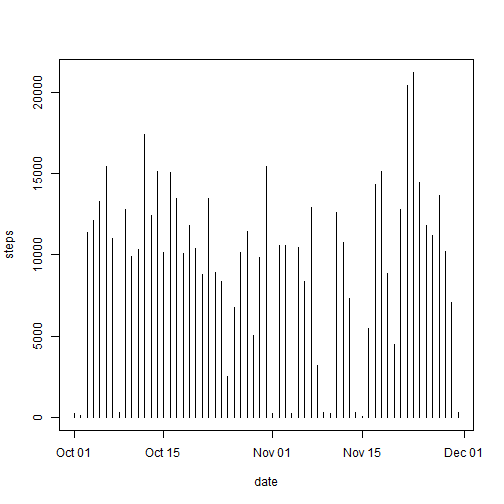

## Loading and preprocessing the data

```r
# get working directory for project
wd <- getwd()
filePath <- paste(wd, "activity.csv", sep = "/")
# read entire file
library(data.table)
df <- fread(filePath)
# Make the date field a Date type
df$date <- as.Date(df$date)
```


## What is the mean total number of steps taken per day?

```r
a <- aggregate(steps ~ date, data = df, sum)
with(a, plot(steps ~ date, type = "h"))
```

 

```r
# mean of steps, ignore NA's ('Mean & median steps taken each day')
mean(df$steps, na.rm = TRUE)
```

```
## [1] 37.38
```

```r
median(df$steps, na.rm = TRUE)
```

```
## [1] 0
```

## What is the average daily activity pattern?

```r
c <- aggregate(steps ~ date, data = df, mean)
plot(steps ~ date, data = c, type = "l")
```

 

```r
max(c$steps)
```

```
## [1] 73.59
```


## Imputing missing values

```r
d <- aggregate(steps ~ interval, data = df, mean)
# missing values NA's
sum(is.na(df))
```

```
## [1] 2304
```

```r
## use a ramdom sample to replace missing values: This is something just to
## fill the missing data and not entirelly cosure, since it will distort any
## analisys. this is somthing that has to carefully analized dedpending on
## the type of data...

midx <- is.na(df)  # missing index
dfidx <- df[, !midx]  # index without NA 
dfc <- df  # copy df with NA's
dfc[midx] <- sample(dfidx, sum(midx), replace = TRUE)  # complete set
str(dfc)
```

```
## Classes 'data.table' and 'data.frame':	17568 obs. of  3 variables:
##  $ steps   : int  1 1 1 1 1 1 1 1 1 1 ...
##  $ date    : Date, format: "2012-10-01" "2012-10-01" ...
##  $ interval: int  0 5 10 15 20 25 30 35 40 45 ...
##  - attr(*, ".internal.selfref")=<externalptr>
```

```r
aa <- aggregate(steps ~ date, data = dfc, sum)  # logic from above
with(aa, plot(steps ~ date, type = "h"))  # to compare plot...
```

 

```r
# mean of steps, ignore NA's ('Mean & median steps taken each day')
mean(dfc$steps, na.rm = TRUE)  # mean has decreased.
```

```
## [1] 32.61
```

```r
median(dfc$steps, na.rm = TRUE)
```

```
## [1] 0
```


## Are there differences in activity patterns between weekdays and weekends?


```r
# create a field factor with the type of weekday
dfc$daytype <- factor(weekdays(dfc$date) %in% c("Sunday", "Saturday"), labels = c("weekday", 
    "weekend"))
cc <- aggregate(steps ~ interval + daytype, data = dfc, mean)
library(lattice)
xyplot((log(steps)) ~ interval | daytype, data = cc, type = "l", ylab = "Number of Steps", 
    layout = c(1, 2))
```

 

